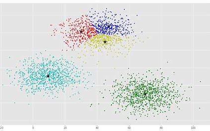

>## *Optimize data dimension utilizing PCA & leverage K-Means to predict crypto clusters.*  
#

 

#

>### Overview: 
>> -Data Preprocessing and reducing data dimensions using PCA

>> -Clustering cryptocurrencies using K-Means,

>> -Visualizing Results

 

>## What is K-Means?
> [Data Science](https://towardsdatascience.com/how-to-apply-k-means-clustering-to-time-series-data-28d04a8f7da3): Clustering technique that serves as an unsupervised learning task where an algorithm groups similar data points without any “ground truth” labels. Similarity between data points is measured with a distance metric, commonly Euclidean distance.
>

 

## Resources:
1. Northwestern NPS:
https://sps.northwestern.edu/

2. K-Means (Medium):
https://towardsdatascience.com/how-to-apply-k-means-clustering-to-time-series-data-28d04a8f7da3.
